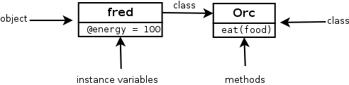
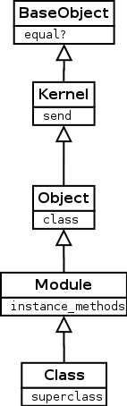
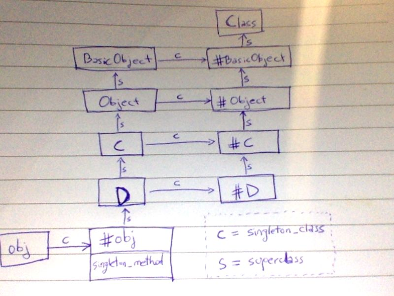

<!-- Auto generated with 'npm run concat' -->

# The Ruby Object Model

Sebastián Gurin - [WyeWorks](wyeworks.com)   

## Contents

<!-- toc -->

- [About this document](#about-this-document)
- [The basics](#the-basics)
  * [Objects and classes](#objects-and-classes)
  * [Instance variables](#instance-variables)
  * [Methods](#methods)
  * [Object, class, method, instance variable relationship](#object-class-method-instance-variable-relationship)
  * [Inheritance](#inheritance)
  * [Method override and `super`](#method-override-and-super)
  * [Class methods and class variables](#class-methods-and-class-variables)
  * [The Ruby class hierarchy](#the-ruby-class-hierarchy)
  * [Superclass](#superclass)
- [Scope](#scope)
  * [self: the current object](#self-the-current-object)
  * [Scope Gates `class`, `module` and `def`](#scope-gates-class-module-and-def)
  * [Flat Scope](#flat-scope)
- [Declarations](#declarations)
  * [Open class](#open-class)
  * [Modules](#modules)
  * [Refinements](#refinements)
- [Messages & methods](#messages--methods)
  * [Simple example](#simple-example)
  * [Message syntax](#message-syntax)
  * [Method syntax](#method-syntax)
  * [Method lookup](#method-lookup)
  * [Message block](#message-block)
    + [yield_self, a.k.a then](#yield_self-aka-then)
- [More on class members and messages](#more-on-class-members-and-messages)
  * [Method visibility and private](#method-visibility-and-private)
  * [Accessors](#accessors)
  * [Class macros](#class-macros)
  * [Accessor methods](#accessor-methods)
  * [Operator overloading](#operator-overloading)
- [The singleton scope](#the-singleton-scope)
  * [Singleton methods](#singleton-methods)
  * [Singleton classes](#singleton-classes)
    + [`class << obj` - the singleton class scope gate](#class--obj---the-singleton-class-scope-gate)
  * [Method lookup and singleton classes](#method-lookup-and-singleton-classes)
  * [Inheritance and singleton classes](#inheritance-and-singleton-classes)
  * [The 7 Rules of the Ruby Object Model](#the-7-rules-of-the-ruby-object-model)
- [Appendix: Constants](#appendix-constants)
  * [Constants paths](#constants-paths)
  * [Module#constants, Module.constants and Module.nesting](#module%23constants-moduleconstants-and-modulenesting)

<!-- tocstop -->

<div class="page-break"></div>

## About this document

When it comes to modeling a problem using an object oriented fashion, each language has its own peculiarities when it comes to, declaring objects and classes, code scope, object instantiation, inheritance, method lookup, etc. 

When we talk about *object model* we are referring basically to these aspects:

 * how to create an object
 * how to send a message to an object
 * how to declare object methods and properties 
 * how to declare object classes, instance methods, instance variables, etc
 * how to declare class inheritance and access the class hierarchy (call super)
 * understand object properties and class members are stored internally
 * how messages are dispatched how method lookup works

This document tries to give a detailed description of how these things works and can be written in Ruby.

 <!-- Particular emphasis is made on Ruby peculiarities compared to other programming languages such as scope, class expressions, .  -->

So, more than an Object Oriented Programming manual for Ruby, this document should be considered as descriptions on how objects work, understanding class declarations and Ruby peculiarities when dealing with objects, clkasses and methods.

It assumes the reader has some background on object oriented programming such as the concepts of object, class, message, method and inheritance. Basic Ruby background is recommended although not needed since the code snippets are simple and commented.

Aside, this is a millennial-friendly document: short paragraphs and code snippets right away!

<div class="page-break"></div>


<i id="the-basics"></i>

## The basics

Let's start by explaining how to define a class and create new object instances in Ruby. In following sections we will be explaining exactly what's happening and how it works in detail, right now the objective is just making sure we know how to do it. 

The following code defines a *class* named `Orc`, with a *method* `eat`. *When* `eat` method is called an *instance variable* `@energy` is created by assigning it to a value. After the class definition, we then create an `Orc` *instance* and store it in *local variable* `fred`:

```rb
class Orc
  def eat
    @energy = 100
  end
end
fred = Orc.new
```

<!-- As you can see, we used `class` to declare a new class. 
The class defines two methods: `initialize` and `eat`. The method `initialize` is analogous to Java or JavaScript `constructor` in the sense that will be called when new instances are created. On it we define an *instance variable* called `@energy` by just assigning it a value. -->

<!--    Relationship between objects, classes, methods and variables -->


<i id="objects-and-classes"></i>

### Objects and classes

**In Ruby everything is an object**, and **every object is associated with a class** of which we say it's an *instance* of. An object's class can be accessed through the method `class`. 

And since everything is an object, classes themselves are instances of a class named `Class`. The following code tries to describe this:

```rb
fred = Orc.new
fred.class # => Orc
Orc.class  # => Class
```

Note that in the previous code, the expression `Orc.new` is calling a method on the object `Orc` which is an instance of `Class`. That method `new` is therefore an instance method of `Class`, that's how the object `Orc` is able to understand the `:new` message. 

This will be described with more detail later, right now, the important thing to understand it that everything is an object which are always associated with a class. And that classes also are objects, instances of `Class`.


<i id="instance-variables"></i>

### Instance variables

Unlike in Java or other static languages, in Ruby there is no connection between an object's class and its instance variables. Instance variables just spring into existence when you assign them a value. In the previous example, the instance variable `@energy` is assigned only when the method `eat` is called. If it's not then the instance variable is never defined. In conclusion we could have Orcs with and without `@energy` instance variable. 

You can think of the names and values of instance variables as keys and values in a hash. Both the keys and the values can be different for each object.


<i id="methods"></i>

### Methods

Besides instance variables objects also have methods. But unlike instance variables, objects that share the same class also share the same methods, so **methods are stored in the object's class and not in the object itself** as instance variables.

So, when we say "the method `eat` of object `fred`" we will be actually referring, generally, to the *instance method* `eat` of `fred`'s class, in our case `Orc`. 

Strictly speaking, when talking about classes and methods, it would be incorrect to say "the method `eat` of `Orc`". `Orc`, viewed as an object, won't understand the message `Orc.eat`. Instead we should say "the *instance method* `eat` of `Orc`". It would be correct to also say "the method `new` of `Orc`" though, since `Orc.new` makes sense.

### Object, class, method, instance variable relationship

The following image tries to illustrate the relationship between objects, classes, instance variables and methods using the previous "orcs" example code. 




<!-- 

Reflection helpers

Now that you know about instance methods, this little section explains how to use two utility methods supported in ruby to inspect our object and classes methods. 

In Ruby any object supports the message `:methods` which will return the array of method names that the receiver object understand. Also, `Class` instances supports the message `:instance_methods` which will return the array of instance method names (passing false will ignore inherited instance methods). The following example try to describe these meta-programming helpers:

```

``` -->


<div class="page-break"></div>


<i id="classes"></i>

## Classes

As said in the previous section, methods of an object are actually instance methods of its class. So in our example, `fred` methods like `eat` are actually *instance methods* of `Orc`. The interesting part is that the same applies to `Orc` viewed as an object. Methods of `Orc`, like `Orc.new`, are *instance methods* of `Class`:

```rb
fred = Orc.new
fred.eat
p fred.class # Orc
p Orc.instance_methods(false) # [:eat]
p Orc.class  # Class
p Class.instance_methods(false) # [:allocate, :superclass, :new]
```

So, if classes are also objects, instances of `Class`, could we just use `Class.new` to define a new class? Of course: See [Flat Scope](#flat-scope) section which contains a snippet that defines a our `Orc` using `Class.new`.

<i id="inheritance"></i>

### Inheritance

In Ruby, the operator `<` is used to extend a class, in other words, to define a subclass. The following snippet which makes our `Orc` extend a base class `Unit`:

```rb
class Unit
  def die
    @energy = 0
  end
end
class Orc < Unit
  def eat
    @energy = 100
  end
end
fred = Orc.new
```

### Method override and `super`

From the previous example, we will override `Unit#die` to customize `Orc`'s behaviors. Notice how we call `super` to execute the original `Unit#die`: 

```rb
class Unit
  def die
    @energy = 0
  end
end
class Orc < Unit
  def die
    super
    p 'Ouch!'
  end
end
```


### Class methods and class variables

The following example shows how to declare class level variables using `@@` and declare class level methods using `def self.`. 

```rb
class Node
  @@default_style = {bg: 'blue', fg: 'white'}
  def render(style = @@default_style)
    p style
  end
  def self.load_from_file(file)
    Node.new # TODO
  end
end
Node.new.render
Node.load_from_file('widget1.json').render
```


### The Ruby class hierarchy

The following diagram shows main classes of standard Ruby class hierarchy and a example method implemented by each.



Some interesting considerations:

 * Although by default, new classes extends from `Object` the root class in the hierarchy is not `Object` but `BaseObject`.
 * `Class` extends `Module` so all classes are also modules.


<i id="superclass"></i>

### Superclass

Similarly than any `Object` instance knows its `class`, also any `Class` instance knows its `superclass`. When defining a new class, if no superclass is specified, new classes extend `Object`.

Let's consider a small example code and represent the `class` and `superclass` relationships between instances and the standard Ruby classes in a diagram: 

```rb
class MyClass
end
obj1 = MyClass.new
p obj1.class # => MyClass
p MyClass.class.superclass # => Module
p MyClass.class.superclass.superclass # => Object
```


<div class="page-break"></div>


<i id="scope"></i>

## Scope

Although the concept of *scope* might seem not directly related with objects and classes, it plays a critical role while dealing with them in Ruby. 

Similar to other scripting languages like JavaScript, understanding the rules for the scope on which the code runs is basic to write object oriented code in Ruby. 

What do we exactly refer to when we say "scope" ? At *any* part of Ruby code, we say that at that moment, the **scope is all the names we can reference** from there, like local variables, instance and class variables, methods, constants, classes, modules, etc.


<i id="self-the-current-object"></i>

### self: the current object

There's a particular object in the scope that represents "*the thing we are talking about now*", in Ruby more formally often called the **current object**. Most languages represent this object with a keyword, in Ruby the keyword `self` is used, while in other programming languages the `this` keyword is often used.

Depending on which part of the code you are, `self` represents different things. It's always present and, in Ruby, it cannot be re-assigned. 

The primordial operation objects must support is to receive messages. The *current object*, this is `self`, acts as the default object when the message receiver is not specified. For example, the following two statements are equivalent:

```rb
a = self.to_s
b = to_s
```

As you can see in the second line, we send a message `to_s` without providing the target object, so the message will be actually be dispatched by `self`, the current object.


<i id="scope-gates-class-module-and-def"></i>
<i id="scope-gates"></i>

### Scope Gates `class`, `module` and `def`

<!-- Besides being the current object for messages, `self` plays an important role while declaring classes.  -->

In ruby, there is no real distinction between code that defines a class and code of any other kind. In a sense, the `class` keyword is more like a *scope operator* than a class declaration. Yes, it creates classes that don't yet exist, but this could be considered just as a nice side effect: the core job of `class` is to *move you to the scope of a class* so you can declare methods. 

There are exactly three places where a program leaves the previous scope behind and opens a new one: 

 * Class definitions
 * Module definitions
 * Methods

And these three places are respectively marked with the keywords `class`, `module`, `def`. When opening one of these *scope gates*, the current scope is replaced so current local variables won't be visible form within the new `class` code.

<!-- For declaring classes we must change the `self` using `class`, and `def` expressions.  -->

The following tries to illustrate how the scope changes through different parts of the code when defining a class. Notice how `class` and `def` are used to change the meaning of `self`, first to a new class `Class1` and then referencing the instance, so we are able to declare classes, instance methods, class methods, etc:

```rb
p self # main
x = 1
class Class1
  # previous local variable "x" is not visible from here

  # inside a class but outside methods, "self" references the class
  p self # Class1

  # instance method declaration:
  def method1
    # inside an instance method, "self" references the instance
    p self # #<Class1:0x00007fc66691d938>
  end

  # class method declaration ("self" here references the class)
  def self.method2
    # inside a class method, "self" references the class
    p self # Class1
  end
end
a = Class1.new
a.method1
Class1.method2
```

Notice how:

 * Inside a method declaration, `self` references *the instance*, similar to the `this` keyword in other programming languages. 
 * Inside a class declaration and outside a method, `self` references *the class*.


<i id="flat-scope"></i>

### Flat Scope

Using Scope Gates like `class` has many advantages since the inner code runs with a fresh scope. But sometimes we need to access outer local variables from inside a class which is not possible if using scope gates as shown in the previous section. 

To workaround this problem, classes can be defined using `Class.new` instead the `class` scope gate. 

Also, for outside local variables to be available inside methods, we need to use `Module#define_method` which allows to define new methods imperatively, without using the scope gate `def`:

```rb
initial_energy = 100
Orc = Class.new do
  define_method :eat do
    @energy = initial_energy
  end
end
```

TODO: more about Class.new and define_method : links or show the signatures


<div class="page-break"></div>


<i id="declarations"></i>

## Declarations

We've already seen in [Scope Gates](#scope-gates), how to change the scope using `class` to declare classes and `def` to declare methods.

<i id="open-class"></i>

### Open class

`class` being a scope gate instead of a declaration, has a practical consequence: we can *reopen existing classes* - even standard library's like String or Array - and modify them on the fly. This technique is often known as *Open Class* or more despectively as *Monkeypatch*.

This allows to partition a class declaration in several files:

```rb
class Sample
  def method1
    'method1'
  end
end
# perhaps in another file
class Sample 
  def method2
    'method2'
  end
end
p Sample.new.method1, Sample.new.method2
```

Also, this allows to add or modify the behavior of standard classes as well:

```rb
class String
  def trim
    self.strip
  end
end
p '  asd ss '.trim
```

<i id="modules"></i>

### Modules

<!-- TODO: Class is a Module  Class < Module < BaseObject. TODO: snippet -->


<!-- modules can be explicitly `include`d in other classes to augment their instance methods, and instance variables. On this regard, one can think of modules as an alternative to inheritance that supports multiple inheritance or in other words, as a syntax to declare the "composition" part in "composition vs inheritance" discussions (TODO link).  -->


<!-- module declaration -->

<!-- The keyword `module` can be used to change the scope to a `class` with the only difference that instead of common class inheritance where the parent class is declared, a `module` is `include`d explicitly by any class. Since a class can `include` several modules, this provides with an alternative to class inheritance when multiple inheritance is needed. This somewhat remembers JavaScript object mixin. 
 -->

Formally, the keyword `module`, similarly as `class` is a scope gate that can be used to declare instance methods and variables that can be `include`d by classes or other modules. 

An important fact to understand, as shown [before](#the-ruby-class-hierarchy) is that **`class` is a `module`, or in other words, `Class` extends `Module`**.
<!-- by the following is that **classes are modules** -->

Similarly to what we've shown in [Scope Gates](#scope-gates), the following snippet illustrates the basics of Ruby modules and how `self` changes in `module` declarations:

```rb
module Module1
  # inside the module scope and outside method declarations, self represent the module 
  p self # Module1
  p self.class # Module
  def method1
    p self # #<A:0x00007fab94822a48>
  end
end
class A
  p self # A
  include Module1
  def method2
    p self # #<A:0x00007fab94822a48>
  end
  def self.class_method1
    p self # A
  end
end
a = A.new
a.method1
```

<!-- TODO: how to declare instance variables or class method from module ?  -->

<i id="refinements"></i>

### Refinements

In [Open Class](open-class) we shown how existing classes can be modified by just opening `class` several times. An important consequence is that any of this modifications will impact the rest of the code "globally" which could cause unexpected behaviors other part of the code that rely on a modified behavior. 

To solve this problem, Ruby supports `refine` which basically allows to open classes but only for local code, without affecting outer code at all:

```rb
module StringUtil
  refine String do
    def reverse
      "REVERSED"
    end
  end
end
module IsolatedCode
  using StringUtil
  p 'hello'.reverse  # "REVERSED"
end
p 'hello'.reverse    # "olleh"
```


<div class="page-break"></div>


<i id="messages-&-methods"></i>

## Messages & methods

Like in other programming languages, the concept of sending a message to an object (or in other words invoking an object's method), is done using the dot operator `.`, like in `tv.change_channel('bbc')`. 

### Simple example

User optionally passes a list of arguments and given object method is invoked using the *target object* as `self` in the method's body code. The expression evaluates in whatever the method returns: 

```rb
class Car
  def turn(where)
    @direction = where
    @@degrees[where]
  end
end
car = Car.new
degrees = car.turn(:left)
```


<i id="message-syntax"></i>

### Message syntax

What's interesting of Ruby is that it support more than one flavor to write message expressions: 

```rb
result = my_object.remove_obsolete(:serie1, [a, b])
result = my_object.remove_obsolete :serie1, [a, b]
```

Another cool syntax alternative for these call expressions are *keyword* arguments. instead of passing a list of unnamed arguments, pass a hash of named arguments. This is particularly useful when building APIs with many arguments:

```rb
result = my_object.players(serie_id: :serie1, filters: [a, b], round: 1)
result = my_object.players serie_id: :serie1, filters: [a, b], round: 1
```


<i id="method-syntax"></i>

### Method syntax

Now how is it implemented each of the message syntax above ?

```rb
class Foo
  def remove_obsolete(serie_id, filter = [])
  end
  def players(serie_id: nil, filter: [], round: nil)
    remove_obsolete(serie_id, filter).select { |person| person.is_playing }
  end
end
```


<i id="method-lookup"></i>

### Method lookup

When you call a method, Ruby does two things:

 1. It finds the method. This is a process called *method lookup*
 2. It executes the method for which it needs to know the *current object* `self`

Although *method lookup* is a process known in most object oriented languages, it's important to understand how this exactly works in Ruby.

Remember how, in [Section Methods](#methods) we said that instance variables are owned nby the instances but instance method's are owned by the class ? So in the simplest case, when Ruby finds an expression like `foo.bar()` it will look for the method `bar` in `foo.class`'s class. 

Because methods could be defined in super classes or in modules [refining](#refinements) super classes, more generally, Ruby will look up for methods by climbing up the object's class ancestors chain. 

**Tip**: Ruby classes support the method `ancestors` which returns the class' ancestors chain, in order, from the class itself, up to `BaseObject`, including modules used or refining the object's class hierarchy. Example: 

```rb
MySubclass.ancestors # => [MySubclass, MyClass, Object, Kernel, BasicObject]
```

Notice that `Kernel`, which is a module, not a class, is also included in the ancestors of `MySubclass`, just like any class.


<i id="message-block"></i>

### Message block

What's unusual in Ruby compared to other languages is that besides the list of arguments, methods also accepts a code block that they can `yield` whatever times they need. For example, in the expression `[1, 2, 3].each() { |item| p item}` we are invoking the method `each` with no arguments and passing a message block right after the call expression. `Array.each` will execute this block passing each of the array's items as argument. 

Let's implement JavaScript `Array.prototype.some` which executes given block on each item until the block returns truthy:

```rb
class Array
  def some
    throw 'No block passed' unless block_given?
    i = 0
    while i < length
      result = yield self[i]
      return self[i] if result
      i += 1
    end
  end
end
# prints "123"
[1, 2, 3, 4, 5].some() do |n|
  print n
  n > 2
end
```

As you can see in the last statement, `some()` is invoked without passing any arguments and next to the call, there's a block expression `do |n| ...`. This is what we call the message block, which is invoked in `some`'s body, using the `yield` expression `result = yield self[i]`. `result` will contain whatever value was returned by given  block.

Also notice how we use `block_given?` to know if a message block was passed.

As a last example, here is a method that accepts both, a callback argument and a message block. In this case, instead of using `yield` and the implicit block, we use an alternative syntax by declaring a last argument starting with `&` in which case it will be the passed block object, if any. Notice how, instead of using `yield` we use `block.call`:

```rb
def set_interval
  # artificial event loop listener
end
def wait_for(predicate, &block)
  timer = set_interval do 
    if predicate
      clear_interval timer
      block.call
    end
  end
end
t = Time.now + 1
wait_for(proc { Time.now > t }) { print '1 second passed' }
```

#### yield_self, a.k.a then

Ruby objects support the method `yield_self` (and its alias `then`). The idea is simple, just pass `self` as the argument to the message block. 

In the snippet `print 2.yield_self { |n| n * 3.14 }` we send the yield_self message to the object `2` which causes given message block to be invoked passing `2` as argument. In the previous code, parameter `n`'s value will be `2`.

Using its alias `then` we can write data transformation as a series of `then`s - feels familiar to JavaScript promises or Elixir pipe operator (`|>`):

```rb
def name_starts_with(data, name_prefix)
  data
    .then { |persons| persons.map { |person| person[:name] } }
    .then { |names| names.select { |name| name.start_with? name_prefix } }
    .then { |names| names.sort }
end
p name_starts_with [{ name: 'andrew' }, { name: 'laura' }], 'a'
```

Note: Ruby objects also support `tap` method but unlike `yield_self`, it yields `self` and returns `self`.

<div class="page-break"></div>


## More on class members and messages

### Method visibility and private

Ruby language supports declaring methods as `public`, `protected` or `private`. In general they have the same purpose as in other languages such as Java or C# but in Ruby, `private` in particular has a peculiar semantics that can be summarized with a single simple rule: **private methods cannot be called with an explicit receiver**. Go back to section [Self: the default object](self-the-default-object) where we described messages with explicit receiver like `foo.bar()` versus messages with implicit `self` receiver like `bar()`. Then every time you call a private method, it must be on the implicit receiver: `self`. If an expression with an explicit receiver is used then it throws an error. 

The following is a controversial example which shows that a private method cannot be called, even from its own class if the message receiver is given explicitly:

```rb
class Foo
  def public_method
    self.private_method
  end
private
  def private_method; end
end
Foo.new.public_method
```

Running the snippet will throw `NoMethodError: private method 'private_method' called [...]`. To solve the problem we just need to replace `self.private_method` with `private_method` - in other words, call the private method with the implicit `self` receiver. 


<i id="accessors"></i>

### Accessors

TODO

```
attr :foo
attr_writable :bar
etc
```

<i id="class-macros"></i>

### Class macros

The ability to run any code inside a class definition, plus its friendly syntax allow Ruby programmers to conceptualize what we call **class macros**. Formally, they are statements inside the class scope calling class methods to perform operations on the class itself, often using Ruby's metaprogramming API to modify the class behavior. 

When we described [accessors](#accessors), we where actually talking about `Module`'s class methods that are called in statements inside the class definition. The expression `attr :foo` for example is actually calling `Module.attr()` method. 

For Ruby newcomers, expressions like `attr :foo` in the middle of class definitions could look like a syntax thing, but actually there's no special syntax at all, we are just calling a class method that will modify the class to support `attr` semantics.

Let's write our own class macro `second`, that, given a method named `name` it will create a second method named `"#{name}2"` that calls the original method and log the call:

```rb
class Base
  def self.second(*methods)
    methods.each{|method|
    define_method("#{method}2") do |*args, &block| 
      print "'#{method}' called"
      send method, *args, &block
    end
  }
  end
end
class Elf < Base
  second :foo
  def foo; end
end
elf = Elf.new
elf.foo
elf.foo2 # => 'method' called
```

<!-- Ruby's `Module` class, for example, comes with a variety of class-level utilities to control how user access object's attributes as described . The expression `attr :foo` for example -->


<i id="accessor-methods"></i>

### Accessor methods 

Ruby supports method definition to handle attribute getter and assignation. 

```rb
class Bar
  def foo=(value)
    @foo = value
  end
  def foo
    @foo
  end
end
bar = Bar.new
bar.foo = 2
p bar.foo
```

<i id="operator-overloading"></i>

### Operator overloading

Ruby permits operator overloading, allowing one to define how an operator shall be used in a particular program. For example a `+` operator can be define in such a way to perform subtraction instead addition and vice versa. The operators that can be overloaded are `+`, `-`, `/`, `*`, `**`, `%`, etc and some operators that can not be overloaded are `&`, `&&`, `|`, `||`, `()`, `{}`, `~`, etc.

Operator functions are same as normal functions. The only differences are, name of an operator function is always symbol of operator followed operator object. Operator functions are called when the corresponding operator is used. Operator overloading is not commutative that means that `3 + a` is not same as `a + 3`.

In the following example we write the backbones of a class for complex numbers and implement the `+` operator.

```rb
class ComplexNumber
  attr_reader :real, :imaginary
  def initialize(real = 0, imaginary = 0)
    @real = real
    @imaginary = imaginary
  end
  def +(other)
    ComplexNumber.new @real + other.real, @imaginary + other.imaginary
  end
  def to_s
    "ComplexNumber(#{@real}, #{@imaginary})"
  end
end
a = ComplexNumber.new(1, 1)
b = ComplexNumber.new(2, 2)
print a + b # => ComplexNumber(3, 3)
```


<div class="page-break"></div>


<i id="the-singleton-scope"></i>

## The singleton scope

Remember how we [said before](#methods) that an object's methods are actually part of the object's class and not the object itself? The implication is that objects of the same class share their methods. 

Sometimes though, is useful to support custom object's behavior independently of a particular class, this is, given an object patch the object itself with custom behavior, without impacting the object's class. 

This makes 

Although this is often not supported by static languages like Java or C++, other scripting languages like JavaScript supports this very straightforward:

<!-- belong to an object class not to the object itself, then all instances of a class are not part of instances but part of the instance's class. -->

<!-- This section describe how Ruby's solves this problemsingleton methods and singleton classes a Ruby way of defining per-object custom behavior. -->


<!-- Until now, objects of the same class have the same methods since methods are defined at the class level.  -->
<!-- If you came from other scripting languages, such as JavaScript, then you know it's possible to define new methods to a single object without affecting its class as simply as: -->

```js
var obj = new MyClass
obj.method1 = function() { 
  return 'hello' 
}
```

Can we accomplish this in Ruby? The answer to this question will give us the chance to learn Ruby language core features: *singleton methods* and *singleton classes*.

<i id="singleton-methods"></i>

### Singleton methods

The Ruby code equivalent to previous JavaScript snippet could be something like:

```rb
obj = MyClass.new
def obj.method1
  'hello'
end
```

As you can see we've defined a new method `method1` but just for the instance `obj`. The rest of `MyClass` instances won't have it.

Notice how we use the scope gate `def` to define method `obj.method1` without using the `class` operator. 
<!-- We already made something similar when we used `def self.my_method` to define class methods, but this time we use `obj` instead of `self` - both `self` and `obj` are objects and we can use the same synyax without scope gate `class` to define  -->

The same as before but using `define_singleton_method` so we don't need to use `class` scope gate:

```rb
obj = MyClass.new
obj.define_singleton_method(:method1) { 'hello' }
```

An interesting fact is that, **class methods are actually singleton methods of the class**. For example in `MyClass.my_class_method()`, `my_class_method` is actually a singleton method of `MyClass`.

<i id="singleton-classes"></i>

### Singleton classes

So, where do these *singleton methods* live ? As we [said](#methods), methods are not part of instances but part of the instance's class. On the other side, singleton methods couldn't be part of the object class since if so, all instances of the class would support them. So, where are singleton methods stored in the Ruby Object Model ? 

In Ruby, objects are associated not only with a class but also with what we call *the object's singleton class*

<!-- When you ask an object for its class, Ruby, doesn't always tell you the whole truth. Instead of the class that you see, an object can have its own special hidden class. That's called the *singleton class* of the object. (Also called the *metaclass* or the *eigenclass*). -->
So while we use `obj.class` to access an object "normal" class, we use `obj.singleton_class` to access an object singleton class. 

#### `class << obj` - the singleton class scope gate

Ruby also supports another syntax besides `singleton_class` to access an object's singleton class which is based on the `class` keyword:

<!-- (BTW, before Ruby TODO.TODO this was the only way to access an object singleton class):  -->

```rb
obj = MyClass.new
class << obj
  def method1
    'hello'
  end
end
```

Remember how we said `class` is a scope gate ? Well in this case the expression `class << obj` opens the scope to `obj`'s singleton class the same way `class C` opens the scope to a "normal" `C` class. Methods and instance variables defined inside will belong to `obj`'s singleton class. 

<!-- TODO: singleton class notation (obj - MyClass, #obj) - #obj represents the singleton class of object `obj` -->

TODO: `obj.singleton_class` extends `obj.class`

TODO: golden object model rules - pg 125


### Method lookup and singleton classes

Previously, in [Method lookup](#method-lookup), we explained how the Ruby interpreter finds a method. Well, that was without considering singleton classes. Now that we know they exists, the missing part is the role of singleton methods in this scenario. 

Heads up: We represent the singleton class of an object `obj` with `#obj`.

```rb
class MyClass
  def method1; end
end
obj = MyClass.new
def obj.method2; end
```


<i id="inheritance-and-singleton-classes"></i>

### Inheritance and singleton classes

As we said previously we represent the singleton class of an object named `obj` with `#obj`. Also, since classes are also objects, we represent the singleton class of a class named `MyClass` with `#MyClass`. As said before, class methods are methods of the class's singleton class, so class methods of `MyClass` are actually singleton methods of `#MyClass`. 

The following diagram shows the relationship between `class`, `singleton_class` and `superclass`.




### The 7 Rules of the Ruby Object Model

In this mix of classes, singleton classes, instance methods, class methods and singleton methods, a Ruby developer could have a hard time answering questions like: "Which method in this complicated hierarchy gets called first?" or "Can I call this method from that object?". The following seven rules describe the relationwhip between classes, singleton classes, instance methods, class methods and singleton methods and also gives a recipe on how method lookup works, now considering singleton classes and singleton methods:

 1. There is only one kind of object - be it a regular object or a module.
 2. There is only one kind of module - be it a regular module, a class or a singleton class. 
 3. There is only one kind of method, and it lives in a module - most often in a class.
 4. Every object, class included, has its own "real class", be it a regular class or a singleton class. 
 5. Every class, with the exception of `basicObject`, has exactly one ancestor - either a superclass or a module. This means you have a single chain of ancestors from any class up to `BasicObject`.
 6. The superclass of a singleton class of an object is the object's class. The superclass of the singleton class of a class is the singleton class of the class's superclass. (Yes, it sounds like a tongue twister, we tried to describe this in [Inheritance and singleton classes](#inheritance-and-singleton-classes)).
 7. When you call a method, Ruby goes "right" in the receiver's real class and then "up" the ancestors chain. That's all there's to know about the way Ruby finds methods. 

<div class="page-break"></div>


## Appendix: Constants

In Ruby, any reference that **starts with an uppercase letter**, including name of classes and modules, is a *constant*. Ruby constants are very peculiar when compared to other programming language's constants. 

First of all, unlike other programming languages, Ruby constants can be changed and reassigned. For example, try to re-assign constant `String` to break Ruby beyond repair. 

Second, class names and module names are constants. In the following example both `MyClass` and `my_class` references to the same instance of `Class` with the only difference being that `MyClass` is a constant and `my_class` a local variable:

```rb
class MyClass
end
my_class = MyClass
```

So, if we can change the value of a constant, how are they different from a variable? The only important difference has to do with their scope. 

All the constants in a program are arranged in a tree similar to a file system where modules (and classes) are *directories* and regular constants are *files*. Like in a file system, we can have multiple files with the same name as long as they live in different directories. We can even refer to constants by their *path*, as we would do with a file. 

### Constants paths

In the following example we have some modules and classes which defines constants and reference inner and outer constants by their paths. Notice that constants' paths use a double colon as a separator (similar to C++ scope operator). Also, we can reference a constant by its *absolute path* by prefixing the constant path with `::` : 

```rb
X = 'constant 1'
module M
  X = 'constant 2'
  class C
    X = 'constant 3'
    p ::X         # => constant 1
    p ::M::C::X   # => constant 3
  end
end
p X               # => constant 1
p M::X            # => constant 2
p M::C::X         # => constant 3
```

### Module#constants, Module.constants and Module.nesting

Ruby's `Module` class aso provides the instance method `Module#constants` which returns all constants in the current scope, analogous to the `ls` UNIX command. 

Also, the class method `Module.constants` will return all the top-level constants in the current program, including class names. 

Finally, we can use the class method `Module.nesting` to get the *current path*:

```rb
module M
  class C
    module M2
      p Module.nesting   # => [M::C::M2, M::C, M]
      p Module.constants # => [:M2, :C, a lot more...
    end
  end
end
```


<div class="page-break"></div>

